<h1 align="center">Class-Booking</h1>

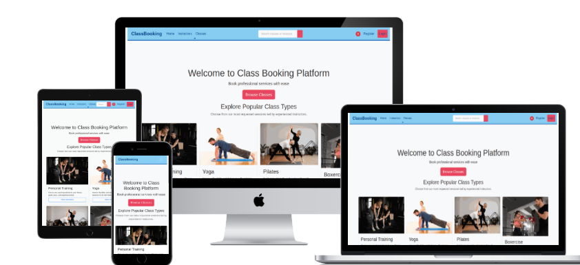

Class booking is an e-commerce website project created for a fictional fitness class booking platform based in North West London. The main objective of site is to create a user-fiendly enable students to book a class using an easy and intuitive approach. User has four class types to book: Personal training, Yoga, Pilates and Boxercise. The site owner only recommends Instructors who are approved and accredited.

Project was created using Python, Django, HTML5, CSS3, and JavaScript. The data was stored in a PostgreSQL database manipulation and deployed using Heroku. AWS is used for media storage and Stripe to accept payments.
Class-Booking is my forth milestone project for Code Institute's Level 5 Diploma in Web Application Development.

[View the live site](https://class-booking-ed512f961728.herokuapp.com/)

# Table contents
* [Strategy](#strategy)
* [Structure](#structure)
* [Skeleton](#skeleton)
* [Surface](#surface)
* [Features](#features)
    * [Home Page](#home-page)
    * [Product Page](#products-page)
    * [Profile Page](#profile-page)
    * [Contact Form](#contact-form)
    * [Authentication](#authentication)
* [Technologies](#technologies-used)
* [Testing](#testing)
* [Future Enhancements](#Future-Enhancements)
* [Deployment](#deployment)
* [Credits](#credits)

## Strategy

### User stories

1. As a first time user, I want to; 

* Search for classes by class type of class from the navigation menu
* Search for a class for unified search input
* Search for classes I am interested in  
* Look for various class instructors, from the Instructors page
* Register my profile as a student
* Login as a student enabling me to create a class booking
* Book  a class according to my schedule and date instructor is available 
* Make a secure payment for a class 
* Receive a class booking confirmation mail

2. A a regular student, I want to;

* Login to view my bookings
* Login to make further class bookings with ease
* Acess the site from various devices with response, clear appearance and functionality
* All the above as the first time user
 
3. As a Site Administrator: I want to 

* Update Class Instructors
* Update class types
* Update photos of class instructors
* Add/Edit/Delete class descriptions
* Add/Edit/Remove class rates and packages
* Access payments received by Stripe using webhooks from my stripe portal
* Update Adhoc site content and data.

* ## Structure

 ### Database Schema
The database was designed using DpDiagram.io. There are 5 tables within this relational database: User, Cake, Customer, Order and OrderItem.
<details><summary>ERD</summary>
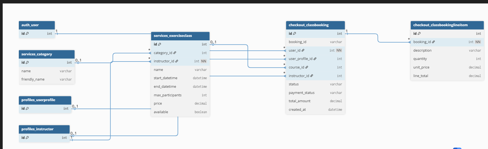
</details>


## Skeleton
   ### Wireframes

<details><summary>Home Page</summary>
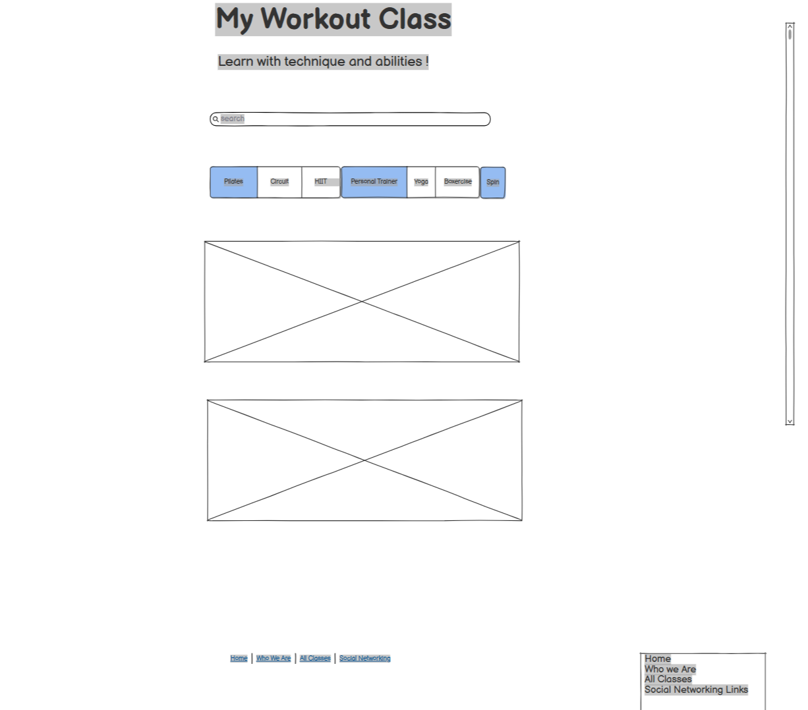
</details>
<details><summary>Type of Class</summary>

</details>
<details><summary>Class Description</summary>
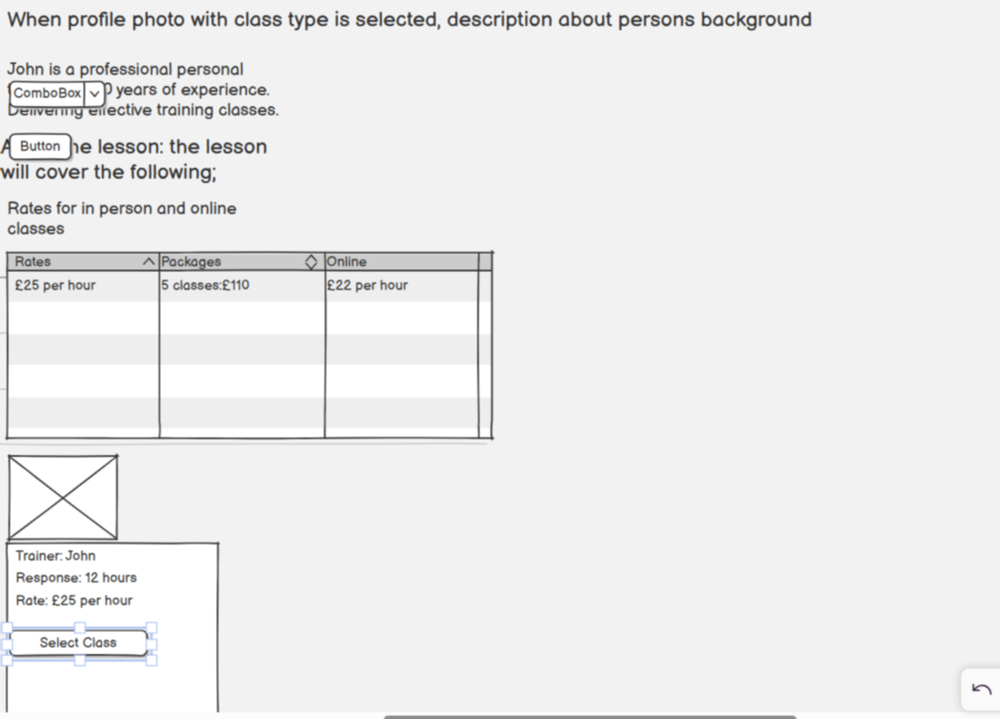
</details>
<details><summary>Card payment Template</summary>
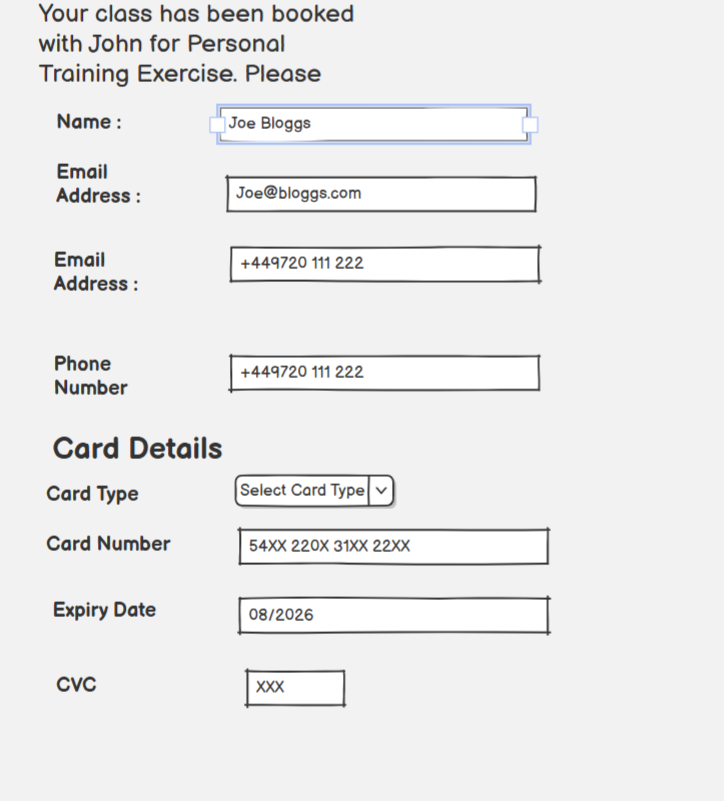
</details>

-   ### Database Schema
* The database was designed using dbdiagram.io(see credits). 
<details><summary>ERD</summary>
There are 7 tables within this relational database:  auth_user, services_category, profiles_userprofile, profiles_instructor, service_exerciseclass, checkout_classbooking and checkout_classbookinglineitem. Instructor has a one-to-many relationship with the Course model. User Profile has a one-to-many relationship with BookingEnquiry. 

</details>


    
- - - 

## Surface

### **Colour** 
The Colour palette is a mixture of 3 colours. Dark blue for the header, white colour for the main body and Purple for the footer.The buttons consists of red and blue colours.
 

### **Typography** 

Fonts were imported from [Google Fonts](https://fonts.google.com/). 

I selected  "Arial"  as the primary font for the main body and Sans-Serif as the Secondary font . I found the Aerial font is a simple, user-friendly, outstanding and clean typeface that contributes the design. I have used Arial has the primary for my previous 3 projects and wanted to main the font typography.
I selected light blue, white as the main body colors and purple for the footer. 

# Features

## Home Page

## User Functionality

<details><summary>Home Page</summary>
Site is opened on this page
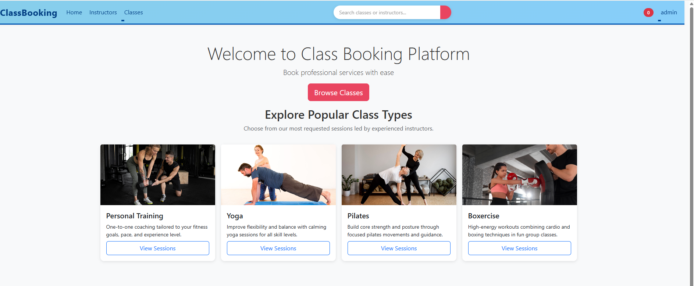
</details>
<details><summary>Classes Type</summary>
Students can view a range class types offfered on this platform from the classes page.Clicking on 'Browse Classes' directs you to the same page too.
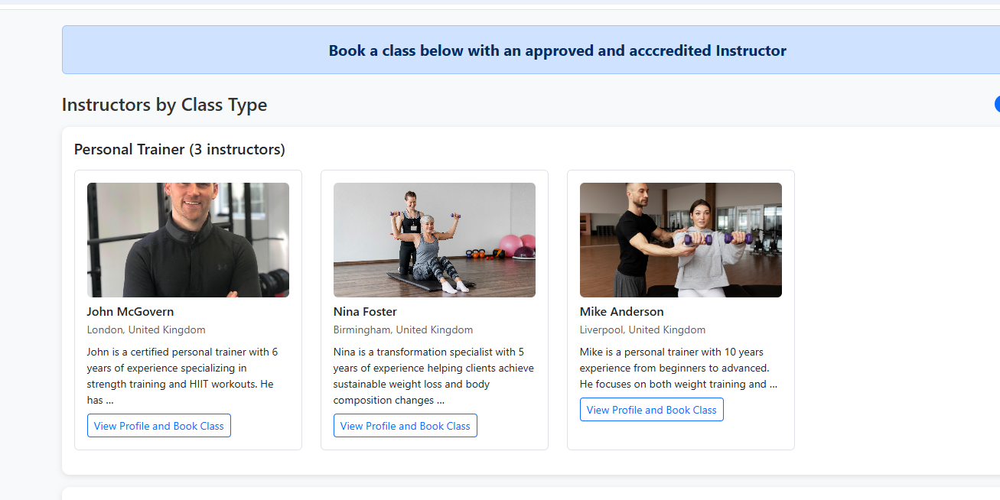
</details>
<details><summary>Instructors</summary>
Students can view a range of Instructors on this page.

</details>
<details><summary>Login</summary>
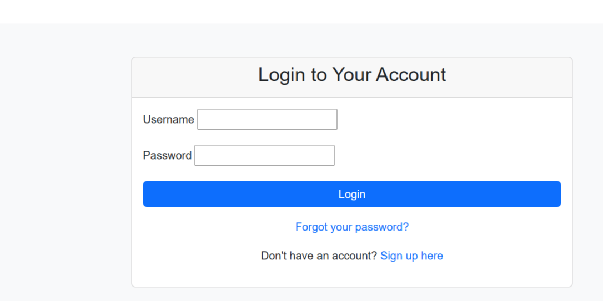
</details> Customer are required to register and login before booking a class
<details><summary>Password Reset</summary>

</details> Students can request a password reset should they forget their login details. Entering an email address registered on our system will enable them to receive a password reset link to reset their password.
<details><summary> Instructor profile and Book class</summary> 

</details>Students can view any Instructors profile, view rates and packages information and book a class
<details><summary>Scheduled Class</summary>

</details>students can book an upcoming scheduled class with their instructor
<details><summary>Class Packages</summary>
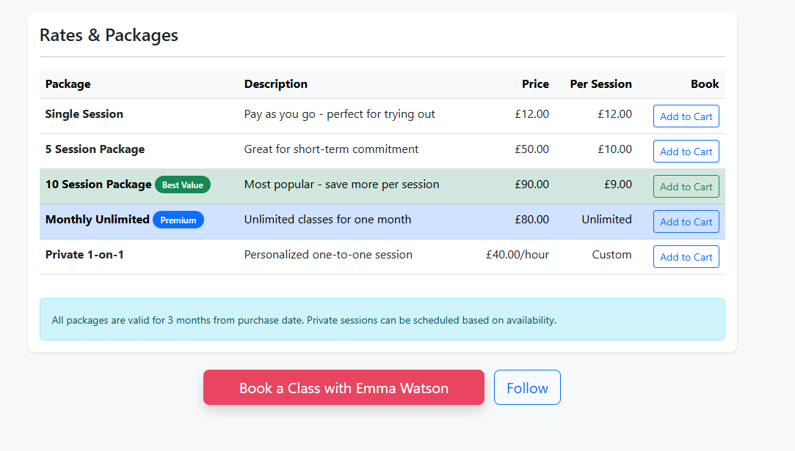
</details>Students have the option of selecting a package of classes to purchase
<details><summary>Booking Cart</summary>
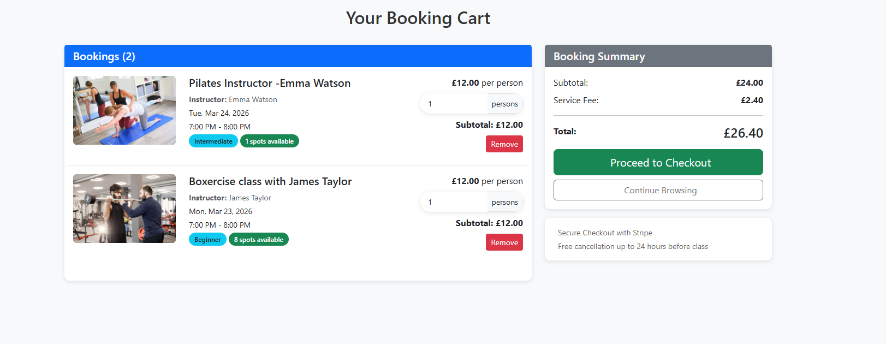
</details> Students can view their booking cart displaying class bookings, boooking summary with total cost with the option of proceeding to checkout page, editing a class by removing or going back to classes to view and book a different class type.
<details><summary>Edit Cart</summary>

</details> Students can remove a class from the booking cart page
<details><summary>Checkout</summary>
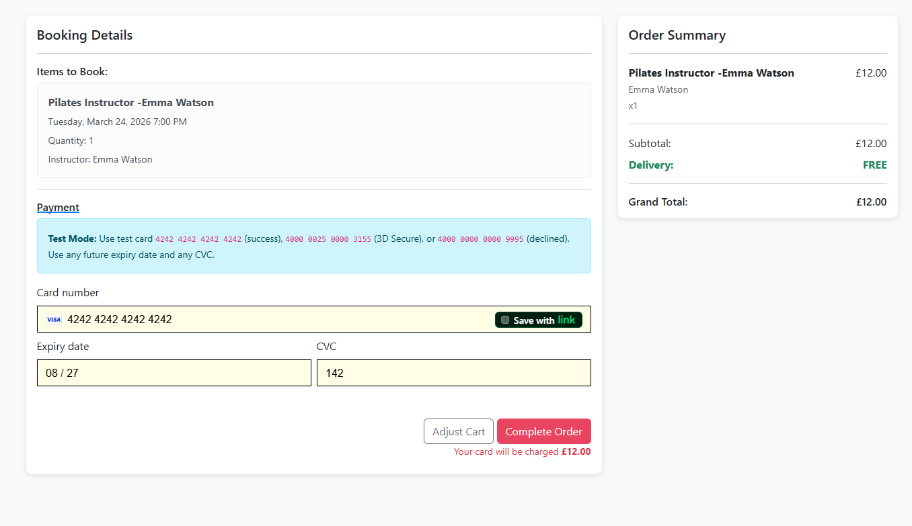
</details> At the checkout page, students are presented to enter their card details and complete order. The site is in test mode so only default test card number can be accepted
<details><summary>Confirmation</summary>
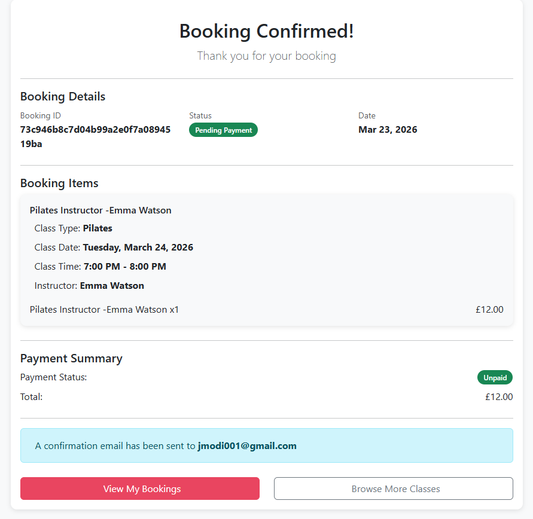
</details> Confirmation window that your card details have been accepted
<details><summary>Email Class Booking Confirmation</summary>
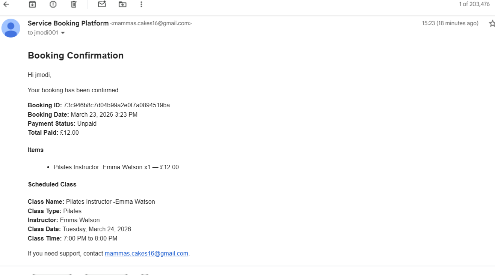
</details> Confirmation the student has received class booking confirmation
<details><summary>Stripe Transaction Summary</summary>
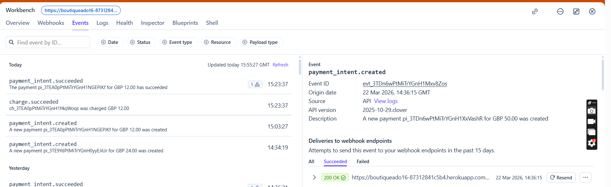
</details> Stripe Dashboard in the Events and Logs show payment has succeeded
<details><summary>Contact Us Form Summary</summary>
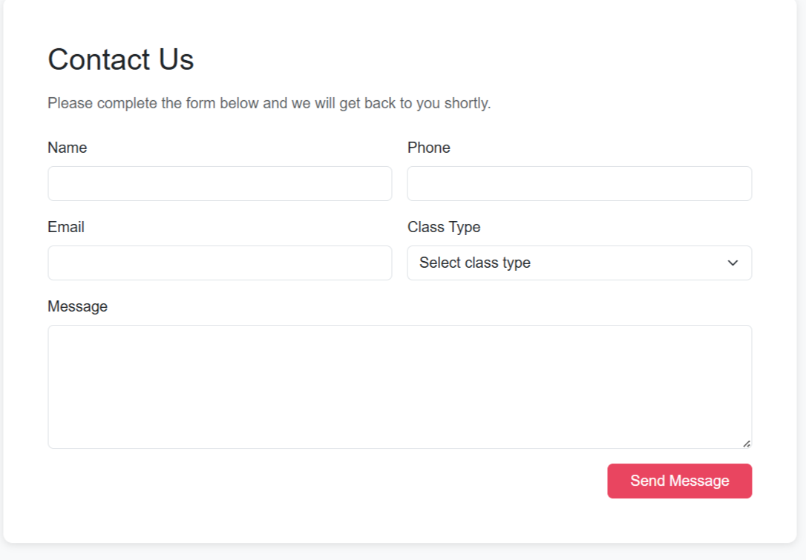
</details> Site users have the option to access the contact us form in the quick link sections. Once completed, form is submitted to site owner.

 ## Site Admin 
Site Administrators only have priveleges to modify the site such as;  add / remove classes in categories, add, remove or modify class instructors, student profiles, email addresses, add, remove and edit scheduled exercise classes using super user login credentials. Please see below

<details><summary>Admin Site Login</summary>
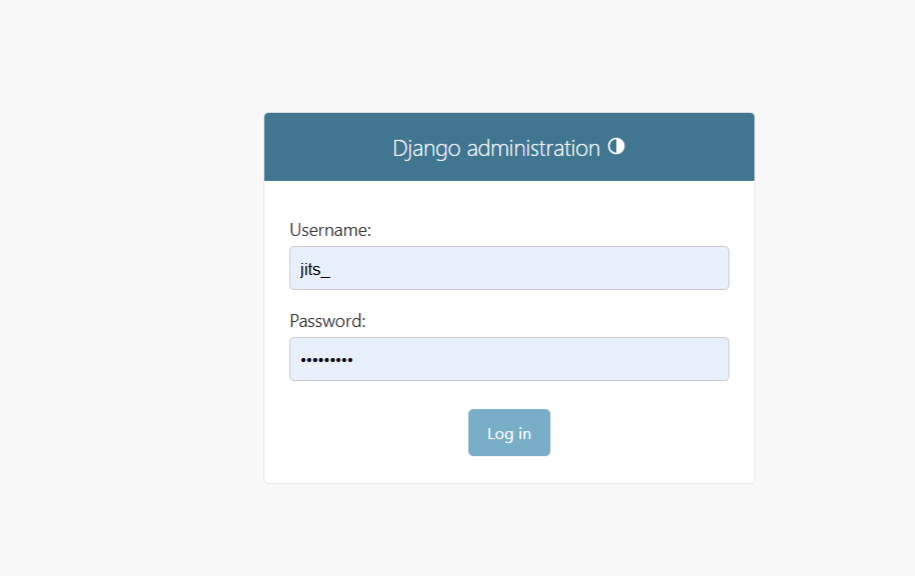
</details> Administrators can login via the site home page using their super user credentials.
<details><summary>Site Administration</summary>
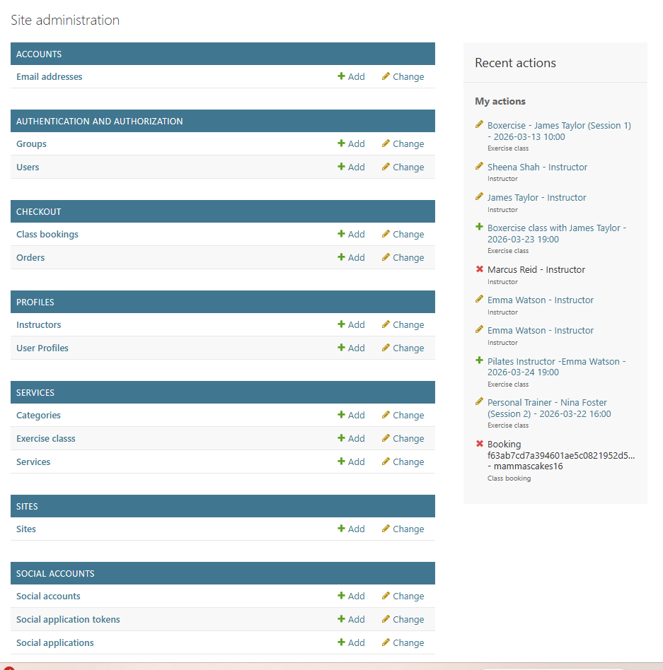
</details> Administrators can use this section to add / remove classes in categories, add, remove or modify class instructors, student profiles, email addresses, add, remove and edit scheduled exercise classes
<details><summary>Instructors Admin/summary>
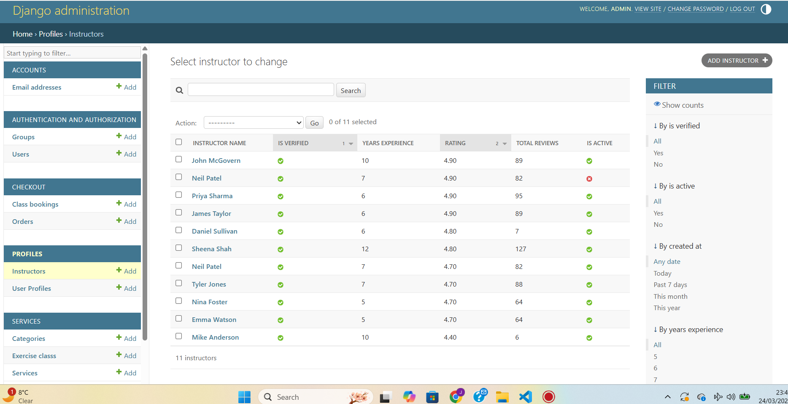
</details> Administrators can add and remove class Instructors from this Profiles, Instructors
<details><summary>Class Categories</summary>
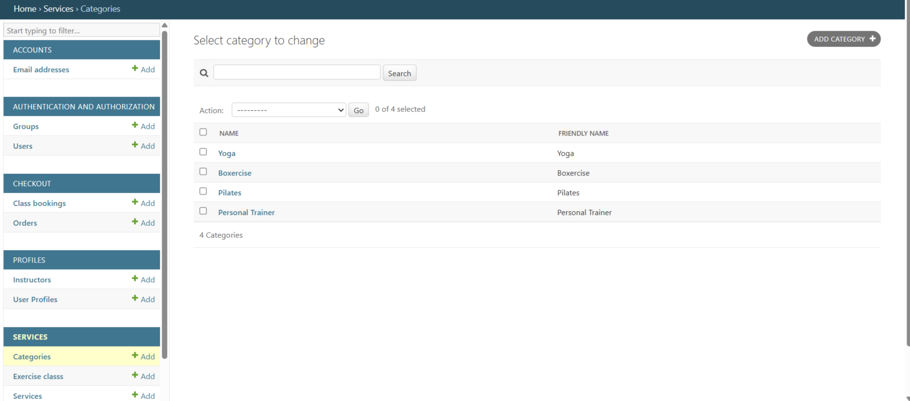
</details> Administrators can add and remove type of classes from Services, Categories
<details><summary>Add a class </summary>
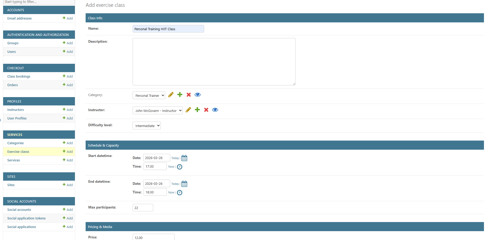
</details>Admins can add / edit or remove a scheduled class
<details><summary>  Classes Scheduled  </summary>
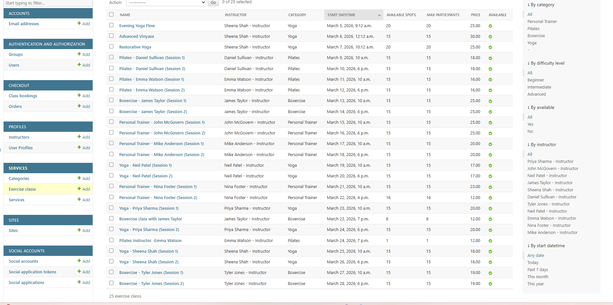
</details>Admins can view upcoming scheduled classes and past classes in Services, Exercise classes.
<details><summary> Email   </summary>

</details>Admins can view upcoming scheduled and past scheduled classes booked by students and past classes in Checkout, Class bookings.

## Technologies Used

## Language
* HTML - Used for the main structure of the page
* CSS - Used for styling, combined with Bootstrap
* JavaScript - Used for fronend interactive features
  * Stripe Payment Functionality
  * Update Add/Remove classes from booking cart
  * Checkout function
* Python - Used for the core of the page backend
  * Python Modules Used:
    * asgiref==3.7.2
    * boto3==1.28.80
    * botocore==1.31.80
    * dj-database-url==0.5.0
    * Django==3.2.22
    * django-allauth==0.41.0
    * django-countries==7.2.1
    * django-crispy-forms==1.14.0
    * django-ses==3.5.0
    * django-storages==1.14.2
    * gunicorn==21.2.0
    * jmespath==1.0.1
    * oauthlib==3.2.2
    * Pillow==10.1.0
    * psycopg2==2.9.9
    * python3-openid==3.2.0
    * pytz==2023.3.post1
    * requests-oauthlib==1.3.1
    * s3transfer==0.7.0
    * sqlparse==0.4.4
    * stripe==7.6.0
    * urllib3==1.26.18
* Tools
  * [GitHub](https://github.com/) - used as repository to store all development and image files from workspace
  * [VS Code](hhttps://code.visualstudio.com/) - used as the core development workspace platform,, to create all files and store images for project
  * [Heroku](https://dashboard.heroku.com/) - used to deploy the site
  * [Favicon.io](https://favicon.io/) - used for a browser tab icon
  * [Bootstrap5](https://getbootstrap.com/) - used for the styling as well as the responsivness of the site
  * [Google Fonts](https://fonts.google.com/) - used to select and import font for the project
  * [JsHint](https://jshint.com/) - used for validating the javascript code
  * [CI Phython Linter](https://pep8ci.herokuapp.com/) - used for validating the python code
  * [HTML - W3C HTML Validator](https://validator.w3.org/#validate_by_uri+with_options) - used for validating the HTML
  * [CSS - Jigsaw CSS Validator](https://jigsaw.w3.org/css-validator/#validate_by_uri) - used for validating the CSS
  * [Chrome Del Tools](https://developer.chrome.com/docs/devtools/) - used for debugging and testing with Lighthouse
  * [AWS](https://aws.amazon.com/) - for storing media and static data
  * [Stripe](https://dashboard.stripe.com/)- to accept payments in test mode, view status of transactions
  * [Gmail](https://mail.google.com/mail)- used as email host provider to send and receive mail
  * Django Admin- to manage backend data , profiles and information from the backend.


## Testing

Extensive testing was carried out on this project. Please review [testing.md](testing.md) for all testing performed.


## Deployment

-   ### Version Control

This website was created using the CI full template (https://github.com/Code-Institute-Org/ci-full-template)

#### Database creation

To create the database:
1. Navigate to the CI Database Maker(https://dbs.ci-dbs.net/) which creates a new PostgreSQL database.
2. Type in your email address into the input field as directed and click submit
3. You will receive an email with the new PostgreSQL instance. Keep these details safe, they will be used shortly.

#### Heroku
To deploy class-booking to Heroku, take the following steps:
1. Create a requirements.txt file using the terminal command `pip freeze > requirements.txt`
2. Create a Procfile with the terminal command `echo web: python app.py > Procfile`. Ensure you use a capital 'P' for this file.
3. `git add` and `git commit` these changes and `git push` to GitHub repository
4. Go to the Heroku website and login. Create a new app by clicking the "New" button in your dashboard.
5. Give the app and name and set the region to Europe(or your closest region)
6. From the heroku dashboard of the new app, click on "Deploy" > "Deployment method" and select Github
7. Confirm the link to the correct GitHub repository
8. In the heroku dashboard for the application. click on the "settings" > "Reveal Config Vars"
9. Ensure these config vars in the final setup:

| Key                   | Value             |
|-----------------------|-------------------|
| AWS_ACCESS_KEY_ID     | 'AWS_ID'          |
| AWS_SECRET_ACCESS_KEY | 'AWS_SECRET'      |
| DATABASE_URL          | 'DB_URL'          |
| EMAIL_HOST_PASSWORD   | 'EMAIL_HOST_PASS' |
| EMAIL_HOST_USER       | 'EMAIL_HOST_USER' |
| SECRET_KEY            | 'SECRET_KEY'      |
| STRIPE_PUBLIC_KEY     | 'STRIPE_PUBLIC'   |
| STRIPE_SECRET_KEY     | 'STRIPE_SECRET'   |
| STRIPE_WH_SECRET      | 'WH_SECRET'       |
| USE_AWS               | True              |

(this is an example, actual env variable not disclosed to maintain security. To get the db url follow [CI PosgreSQL](https://dbs.ci-dbs.net/))

10. In the Heroku dashboard, click "Deploy"
11. In the "Manual Deployment" section, ensure the main branch is selected then click "Deploy Branch"


#### Connect new DB to Heroku app
1. In the terminal, install dj_database_url and psycopg2, both of these are needed to connect to your external database.

2. pip3 install dj_database_url==0.5.0 psycopg2
3. Update your requirements.txt file with the newly installed packages

4. pip freeze > requirements.txt
5. In your settings.py file, import dj_database_url underneath the import for os
```
 import os
 import dj_database_url
```
6. Scroll to the DATABASES section and update it to the following code, so that the original connection to sqlite3 is __commented out__ and we connect to the new database instead. Paste in the database URL from your PostgreSQL from Code Institute email as below (do not commit these changes)
```
#DATABASES = {
#     'default': {
#          'ENGINE': 'django.db.backends.sqlite3',
#          'NAME': os.path.join(BASE_DIR, 'db.sqlite3'),
#      }
#  }
     
 DATABASES = {
     'default': dj_database_url.parse('your-database-url-here')
 }
``` 
7. In the terminal, run the show migrations command to confirm you are connected to the external database
```
python3 manage.py showmigrations
```
you should see a list of all migrations
8. Migrate your database models to your new database
```
 python3 manage.py migrate
```
9. Create a superuser- follow the steps after entering the following command
```
 python3 manage.py createsuperuser
```
10. Revert changes made in step 8.
11. Update code in settings.py as follows:
```
if 'DATABASE_URL' in os.environ:
    DATABASES = {
        'default': dj_database_url.parse(os.environ.get('DATABASE_URL'))
    }
else:
    DATABASES = {
        'default': {
            'ENGINE': 'django.db.backends.sqlite3',
            'NAME': os.path.join(BASE_DIR, 'db.sqlite3'),
        }
    }
```
12. Install gunicorn and add to requirements:
```
pip3 install gunicorn
pip3 freeze > requirements.txt
```
13. Within the Procfile add `web: gunicorn app-name.wsgi:application` (add app name where indicated), this tells Heroku to create a web dyno and serve our django app.
14. Go to local CLI and login to Heroku using `heroku login -i` and enter heroku login details (email and password from Required Authentications within the Applications section). 
15. temporarily disable collect static. This tells Heroku not to collect static files when we deploy:
```
heroku config:set DISABLE_COLLECTSTATIC=1 --app heroku-app-name-here
```
16. Add the Heroku app and localhost (which will allow GitPod to still work) to ALLOWED_HOSTS = [] in settings.py:
```
ALLOWED_HOSTS = ['heroku deployed site URL here', 'localhost' ]
```

17. Initialise Heroku git remote to app by typing the following command:
```
heroku git:remote -a <name_of_your_app>
```
18. Then push to heroku
```
git push heroku
```
19. Save, add, commit and push the changes to GitHub. You can then also initialize the Heroku git remote in the terminal and push to Heroku with:
```
heroku git:remote -a {app name here}
git push heroku main
```
You should now be able to see the deployed site (without any static files as we haven't set these up yet).
20. Set app up to automatically deploy when we push to github. Go to Heroku and click 'Deploy' tab. Click Github option and search for github repo in input field. Once found, click connect. Now click 'Enable automatic deploys'
21. Generate a Django secret key using a secret key generator. Add this in config vars in Heroku.
22. Add changes to settings.py:
```
SECRET_KEY = os.environ.get('SECRET_KEY', '')
DEBUG = 'DEVELOPMENT' in os.environ
```


### Set Up AWS to store static and media files

1. Sign up to AWS [here](https://aws.amazon.com/).
2. Created an account and logged in, under the All Services>Storage menu, click the link that says S3.
3. On the S3 page create a new bucket. Click the orange button that says 'Create Bucket'
4. Name the bucket and select the closest region to you
5. Under 'Object Ownership' select 'ACLs enabled' and leave the Object Ownership as Bucket owner preferred 
6. Uncheck the 'Block all public access' checkbox and check the warning box to acknowledge that the bucket will be made public, then click create bucket 
7. Once created, click the bucket's name and navigate to the properties tab. Scroll to the bottom and under 'Static website hosting' click 'edit' and change the Static website hosting option to 'enabled'. Copy the default values for the index and error documents and click 'save changes'
8. Now navigate to the permissions tab, scroll down to the Cross-origin resource sharing (CORS) section, click edit and paste in the following code:
    ```
   [
        {
            "AllowedHeaders": [
            "Authorization"
            ],
            "AllowedMethods": [
            "GET"
            ],
            "AllowedOrigins": [
            "*"
            ],
            "ExposeHeaders": []
        }
    ]
    ```
9. Then scroll back up to the 'Bucket Policy' section. Click 'edit' and then 'Policy generator'. This should open the AWS policy generator page
10. Under the 'select type of policy' dropdown menu, select 'S3 Bucket Policy', and inside 'Principle' allow all principals by typing a '*'
11. From the 'Actions dropdown menu select 'Get object'. Then head back to the previous tab and locate the Bucket ARN number. Copy that, return to the policy generator and paste it in the field labelled Amazon Resource Name (ARN)
12. Once that's completed click 'Add statement', then 'Generate Policy'. Copy the policy that's been generated and paste it into the bucket policy editor
13. Before you click save, add a '/*' at the end of your resource key. This is to allow access to all resources in this bucket
14. Once those changes are saved, scroll down to the Access control list (ACL) section and click 'edit'
15. Next to 'Everyone (public access)', check the 'list' checkbox. This will pop up a warning box that you will also have to check. Once that's done click 'save'

### IAM
When your bucket is ready you need to create a user to access it.

1. In the top of the window search for IAM and select it.
2. Once on the IAM page, click 'User Groups' from the side bar, then click 'Create group'
3. Name the group 'manage-*your-project-name*' and click 'Create group' at the bottom of the page
4. From the sidebar click 'Policies', then 'Create policy'
5. Go to the JSON tab and click 'import managed policy'. Search for 'S3' and select 'AmazonS3FullAccess' and click import
6. Once this is imported you need to make small changes. Go back to your bucket and copy your ARN number. Head back to this policy and update the Resource key to include your ARN, and another line with your ARN followed by a /*. It should look like this: 
    ```
    {
        "Version": "2012-10-17",
        "Statement": [
            {
                "Effect": "Allow",
                "Action": [
                    "s3:*",
                    "s3-object-lambda:*"
                ],
                "Resource": [
                    "YOUR-ARN-NO-HERE",
                    "YOUR-ARN-NO-HERE/*"
                ]
            }
        ]
    }
    ```
7. Click 'Next: Tags', 'Next: Review', and on this page give the policy a name, and description, and click 'Create policy'
8. This will take you back to the policy page where you should be able to see your newly created policy. Now you need to attach it to the group you created before 
9. Click 'User groups', and click the your group. Go to the permissions tab and click 'Add permission' and from the dropdown click 'Attach policies'
10. Find the policy you just created, select it and click 'Add permissions'.
11. Finally you need to create a user to put in the group. Select users from the sidebar and click 'Add user' 
12. Give your user a user name, check 'Programmatic Access', then click 'Next: Permissions'
13. Select your group that has the policy attached and click 'Next: Tags', 'Next: Review', then 'Create user'
14. On the next page, download the CSV file. This contains the user's access key and secret access key for later use

### Connect AWS to django

1. Install boto3 and django storages and freeze them to the requirements.txt file.
```
pip3 install boto3
pip3 install django-storages
pip3 freeze > requirements.txt
```
2. In settings.py add `'storages',` to installed apps
3. To use our bucket if we are using the deployed site, in settings.py add the following:
```
if 'USE_AWS' in os.environ:
    AWS_S3_OBJECT_PARAMETERS = {
        'Expires': 'Thu, 31 Dec 2099 20:00:00 GMT',
        'CacheControl': 'max-age=9460800',
    }
    
    AWS_STORAGE_BUCKET_NAME = 'enter your bucket name here'
    AWS_S3_REGION_NAME = 'enter the region you selected here'
    AWS_ACCESS_KEY_ID = os.environ.get('AWS_ACCESS_KEY_ID')
    AWS_SECRET_ACCESS_KEY = os.environ.get('AWS_SECRET_ACCESS_KEY')
    AWS_S3_CUSTOM_DOMAIN = f'{AWS_STORAGE_BUCKET_NAME}.s3.amazonaws.com'
```
4. Update Heroku config vars(see Heroku deployment section), remove the DISABLE_COLLECTSTATIC variable.
5. Create a file called custom_storages.py in the root, add imports and custom classes. These will tell the app the location to store static and media files:
```
from django.conf import settings
from storages.backends.s3boto3 import S3Boto3Storage


class StaticStorage(S3Boto3Storage):
    location = settings.STATICFILES_LOCATION


class MediaStorage(S3Boto3Storage):
    location = settings.MEDIAFILES_LOCATION
```

6. To let the app know where to store static and media files, and to override the static and media URLs in production, add to settings.py: 
```
STATICFILES_STORAGE = 'custom_storages.StaticStorage'
STATICFILES_LOCATION = 'static'
DEFAULT_FILE_STORAGE = 'custom_storages.MediaStorage'
MEDIAFILES_LOCATION = 'media'

STATIC_URL = f'https://{AWS_S3_CUSTOM_DOMAIN}/{STATICFILES_LOCATION}/'
MEDIA_URL = f'https://{AWS_S3_CUSTOM_DOMAIN}/{MEDIAFILES_LOCATION}/'
```
7. Save, add, commit and push these changes to make a deployment to Heroku. In the build log you will see that the static files were collected, and in our S3 bucket we can see the static folder with all the static files in it.
8. Navigate to S3 and open the bucket. Create folder and name it 'media', to store all the media files for the site. Add media files for site by clicking upload and choosing the relevant files.

#### Correct settings.py configuration
1. Ensure the following final setup within the settings.py file looks like this:
```
STATIC_URL = '/static/'
STATICFILES_DIRS = (os.path.join(BASE_DIR, 'static'),)

MEDIA_URL = '/media/'
MEDIA_ROOT = os.path.join(BASE_DIR, 'media')

if 'USE_AWS' in os.environ:
     # Cache control
    AWS_S3_OBJECT_PARAMETERS = {
        'Expires': 'Thu, 31 Dec 2099 20:00:00 GMT',
        'CacheControl': 'max-age=94608000',
    }
    
    # Bucket Config
    AWS_STORAGE_BUCKET_NAME = os.environ.get('AWS_STORAGE_BUCKET_NAME')
    AWS_S3_REGION_NAME = os.environ.get('AWS_S3_REGION_NAME', 'eu-north-1')
    AWS_ACCESS_KEY_ID = os.environ.get('AWS_ACCESS_KEY_ID')
    AWS_SECRET_ACCESS_KEY = os.environ.get('AWS_SECRET_ACCESS_KEY')
    AWS_S3_CUSTOM_DOMAIN = f'{AWS_STORAGE_BUCKET_NAME}.s3.{AWS_S3_REGION_NAME}.amazonaws.com'
    AWS_DEFAULT_ACL = None
    AWS_QUERYSTRING_AUTH = False
    AWS_S3_FILE_OVERWRITE = False

    # Static and media files
    STATICFILES_LOCATION = 'static'
    MEDIAFILES_LOCATION = 'media'

    # Override static and media URLs in production
    STATIC_URL = f'https://{AWS_S3_CUSTOM_DOMAIN}/{STATICFILES_LOCATION}/'
    MEDIA_URL = f'https://{AWS_S3_CUSTOM_DOMAIN}/{MEDIAFILES_LOCATION}/'

DEFAULT_AUTO_FIELD = 'django.db.models.BigAutoField'

# Stripe
STRIPE_CURRENCY = 'gbp'
STRIPE_PUBLIC_KEY = os.getenv('STRIPE_PUBLIC_KEY', '')
STRIPE_SECRET_KEY = os.getenv('STRIPE_SECRET_KEY', '')
STRIPE_WH_SECRET = os.getenv('STRIPE_WH_SECRET', '')

# Email settings
EMAIL_HOST = os.environ.get('EMAIL_HOST', 'smtp.gmail.com')
EMAIL_PORT = int(os.environ.get('EMAIL_PORT', 587))
EMAIL_USE_TLS = os.environ.get('EMAIL_USE_TLS', '1').strip().lower() in ('1', 'true', 'yes', 'on')
EMAIL_USE_SSL = os.environ.get('EMAIL_USE_SSL', '0').strip().lower() in ('1', 'true', 'yes', 'on')
EMAIL_HOST_USER = os.environ.get('EMAIL_HOST_USER', '')
EMAIL_HOST_PASSWORD = os.environ.get('EMAIL_HOST_PASSWORD', '')
EMAIL_FROM_NAME = os.environ.get('EMAIL_FROM_NAME', 'Service Booking Platform').strip()
SUPPORT_EMAIL = os.environ.get('SUPPORT_EMAIL', EMAIL_HOST_USER or 'mammas.cakes16@gmail.com').strip()
EMAIL_BACKEND = os.environ.get('EMAIL_BACKEND', 'django.core.mail.backends.smtp.EmailBackend')

### Set up Stripe Payments

1. Log in to Stripe, click on the developers tab and API keys copy the API key and set them in Heroku as config variables in the following:

- STRIPE_PUBLIC_KEY: Stripe publishable key goes here
- STRIPE_SECRET_KEY: Stripe secret key goes here

2. Back in Stripe set up a new webhook for your deployed site by clicking on webhooks, click on 'add endpoint' and paste in your deployed site's URL followed by /checkout/wh/ and set it to listen for all events.
3. Click on your newly set up webhook and click on 'Signing Secret' at the top to reveal the secret value. Copy it and set it as a new config variable in Heroku:
- STRIPE_WH_SECRET: Signing secret from new webhook.

