# Class-Booking - Testing

# Table of content

* [Validation](#validation)
    * [HTML Validation](#html-validation)
    * [CSS Validation](#css-validation)
    * [JavaScript Linting](#javascript-linting)
    * [Python Linting](#python-linting)
    * [Lighthouse Testing](#lighthouse-testing)
* [Responsiveness](#responsiveness)
* [Manual Testing](#manual-testing)
* [User Stories Testing](#user-stories-testing)
* [Bugs, Issues and Solutions](#bugs-issues-and-solutions)

# Validation 
## HTML Validation
The initial test of the page validated by URL using [W3C HTML Validator](https://validator.w3.org/#validate_by_uri) showed couple of errors but were fixed:

 | Page on site              | Error                                                                                                                                                                                              | Fixed |
| ------------------------- | -------------------------------------------------------------------------------------------------------------------------------------------------------------------------------------------------- | ----- |
| Classes/ Personal Trainer | Bad Value for attribute href on element Illegal character in query. Space is not allowed                                                                                                           | Yes   |
| Classes/ Personal Trainer | The heading h4 follows the heading h2 (with computed level 2) skipping 1 heading level                                                                                                             | Yes   |
| Classes/Pilates           | The heading h4 follows the heading h2 (with computed level 2) skipping 1 heading level                                                                                                             | Yes   |
| Accounts/Login            | The heading h4 follows the heading h2 (with computed level 2) skipping 1 heading level                                                                                                             | Yes   |
| Accounts/Password/Reset   | Consider adding a lang attribute to the html start tag to declare the language of this document. Trailing slash on void elements has no effect and interacts badly with unquoted attribute values. | Yes   |
| Accounts/Password/Reset   | Consider adding a lang attribute to the html start tag to declare the language of this document.                                                                                                   | Yes   |

I have attached screenshots of the test results

Validator results

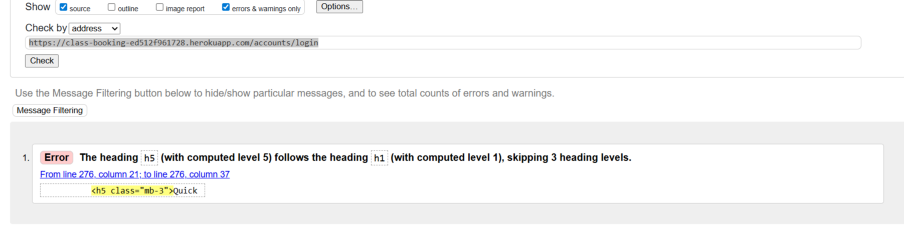

Validator Results

Validator Results

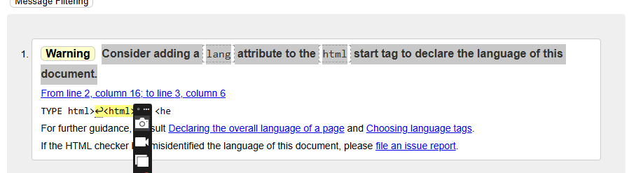

## CSS Validation
I run the CSS code through [W3C CSS Validator](https://jigsaw.w3.org/css-validator/#validate_by_input) by direct input and file upload.
for 4 files

1. Base.css
2. checkout.css
3. classes.css
4. instructors.css

No errors found on any files.
See one screenshot below, which applies to all files

Validator Results

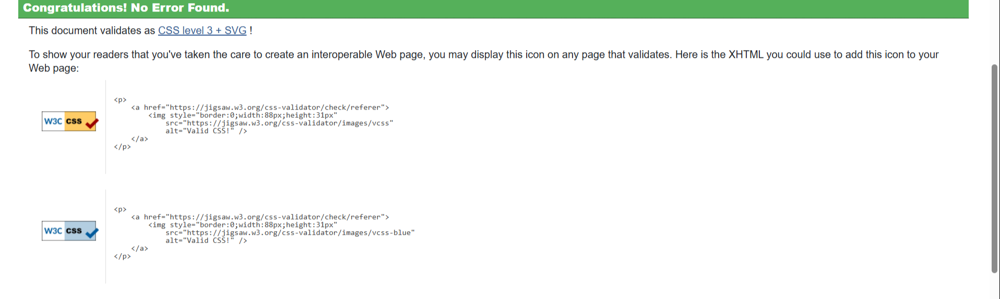

### Warnings

### Warnings

* Vendor extension error - there is nothing to do about this since those extensions help support browser compatibility efforts
* "The Value break-word is deprecated " Replaced word with overflow wrap in checkout.css
* Same colour for background-color and border-color - necessary action to override Bootstrap styling

CSS Warnings

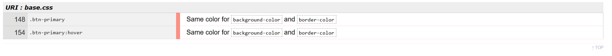

CSS Warning

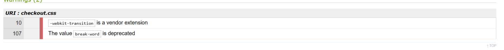

## JavaScript Linting
I have one javescript file stripe_element.js. I ran the JavaScript code through [JSHint](https://jshint.com/), which  showed one missing colon, and one undefined variable Stripe.  I fixed this by  adding  the JSHint-compatible global declaration, declaring Stripe as a known global for JSHint at the top of stripe_element.js. This tells JShint that Stripe is provided externally by Stripe.JS. 

Below shows screenshot with JSHint warnings and JSHint Fixed with Metric information

JSHint Warnings

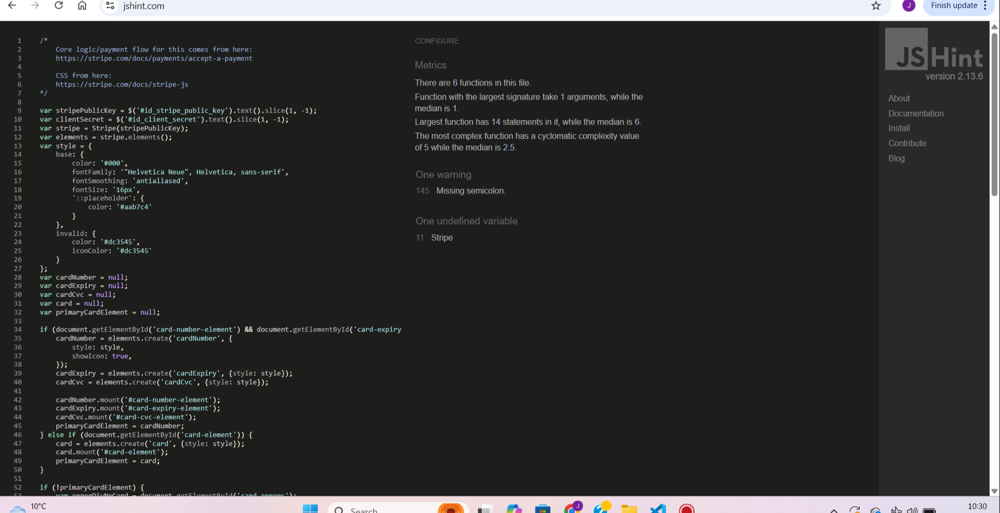

JSHint Fixed

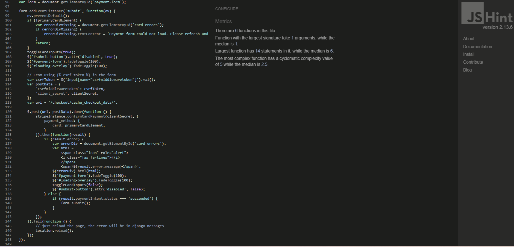

## Python Linting
I ran the code through [CI Python Liner](https://pep8ci.herokuapp.com/), which shows a multiple errors mostly identified blank lines, missing whitespaces and too long lines. Unfortunately, some files could not be resolved only due to the blank line at end of the python script file, common error W292. Please see table below 

| App           | File                                   | Error Warning                                                                                       | Result                                                                    |
| ------------- | -------------------------------------- | --------------------------------------------------------------------------------------------------- | ------------------------------------------------------------------------- |
| class-booking | settings.py                            | lines too long and white spaces                                                                     | No, still W292 error at end of file                                       |
| class-booking | test_s3_functional.py                  | import not at top of file, white space too long, no new line at end of file                         | No, still W292 error at end of file                                       |
| class-booking | populate_instructor_images_and_bios.py | import not at top of file, white space too long                                                     | Fixed                                                                     |
| class-booking | test_stripe.py                         | None                                                                                                |                                                                           |
| class-booking | custom_storages.py\`                   | no new line at end of file                                                                          | No, still W292 error at end of file                                       |
| class-booking | test_s3_config.py                      | E402, E501, W293 and W292                                                                           | Fixed                                                                     |
| class-booking | add_categories.py                      | module level import missing from top and no new line at end of file                                 | No, still W292 error at end of file                                       |
| class-booking | create_postgresql_testdata.py          | E131 continuation line for hanging indent                                                           | Fixed                                                                     |
| class-booking | create_instructor_images.py            | import not at top of file, white spaces too long                                                    | Fixed                                                                     |
| class-booking | create_10_instructors.py               | forbidden to use bare 'except, module import missing at top, white line spaces                      | Fixed                                                                     |
| class-booking | check_instructors.py                   | no new line at end of file, white spaces and missing module import message at top.                  | No, still W292 error at end of file                                       |
| class-booking | get-instructor.py                      | None                                                                                                | Pass                                                                      |
| class-booking | check_data.py                          | no new line at end of file, white spaces and missing module import message at top.                  | No, still W292 error at end of file                                       |
| class-booking | create_upcoming_classes.py             | E302 expected blank line, no blank line at end of file                                              | No, still W292 error at no blank line end of file and expected blank line |
| class-booking | update_instructor_data.py              | module level import missing from top, lines too long.  Uncommented out code or content info on file | Fixed                                                                     |
| Profiles      | admin.py                               | W391 blank line at end of file                                                                      | No, blank line still exists                                               |
| Profiles      | models.py                              | WS293 and E501 and W292                                                                             | Fixed                                                                     |
| Profiles      | urls.py                                | E501 and W292                                                                                       | Fixed                                                                     |
| Profiles      | views.py                               | None                                                                                                |                                                                           |
| Checkout      | views.py                               | lines too long and white spaces, no new line at end of file.                                        | Fixed                                                                     |
| Checkout      | urls.py                                | E501 and W292                                                                                       | No, still W292 error at no new line at end of file                        |
| Checkout      | utils.py                               | W292 no new line at end of file                                                                     | No, still W292 error no new line at end of file                           |
| Checkout      | models.py                              | lines too long and white spaces, expected indented block, blank line at end of file                 | Fixed                                                                     |
| Services      | views.py                               | W292, W293 and E501                                                                                 | No, still W292 error no new line at end of file                           |
| Services      | urls.py                                | WS293 and E501 and W292                                                                             | No, still W292 error no new line at end of file                           |
| Services      | models.py                              | WS293 and E501                                                                                      | No, still W292 error no new line at end of file                           |
| Services      | admin.py                               | E501 and W293                                                                                       | Fixed                                                                     |
| Bookings      | views.py                               | WS293 and E501                                                                                      | Fixed                                                                     |
| Bookings      | urls.py                                | E501 line too long, W292                                                                            | No, still W292 error no new line at end of file                           |
| Cart          | context.py                             | None                                                                                                | No, still W292 error no new line at end of file                           |
| Cart          | apps.py                                | W292, no new line at end of file                                                                    | No, still W292 error no new line at end of file                           |
| Cart          | urls.py                                | no new line at end, lines too long, white spaces                                                    | No, still W292 error no new line at end of file                           |
| Cart          | utils.py                               | E501 lines too long                                                                                 | Fixed                                                                     |
| cart          | views.py                               | E501, E292 and E293 and E302                                                                        | No, blank line still exists                                               |

## Lighthouse Testing
The site was run through Google Chrome Devtools To The main reasons for the low result were:

* Improve Image Delivery- reduce image size and change image from .jpg format .webp format
* Render-blocking resources - AWS, JSDeliver, JQuery impacting rendering page content to the screen, which I wasn't able to improve
* Document Request Latency- Reduce latency by avoiding redirects ensuring faster server response and enable text compression.
* Use efficient cache lifetimes- impacted by stripe utility which could not be adjusted

#### For full results see dropdown below

### Desktop

Home

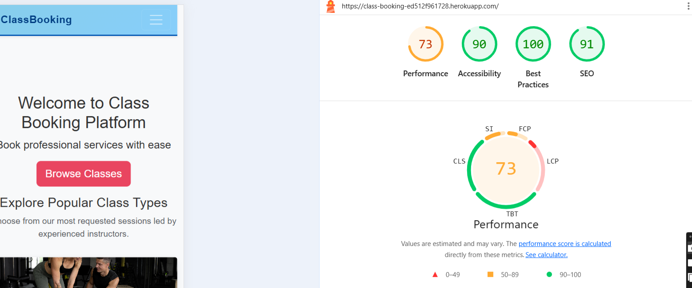

Instructors Page

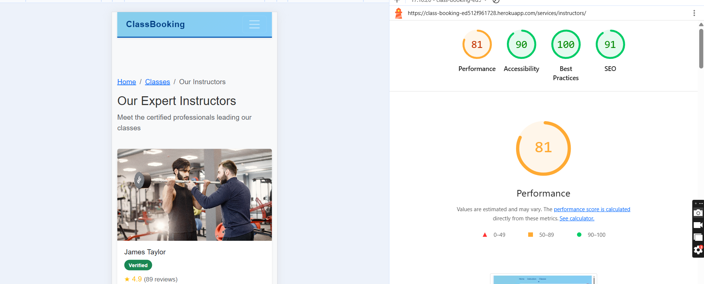

Classes Page

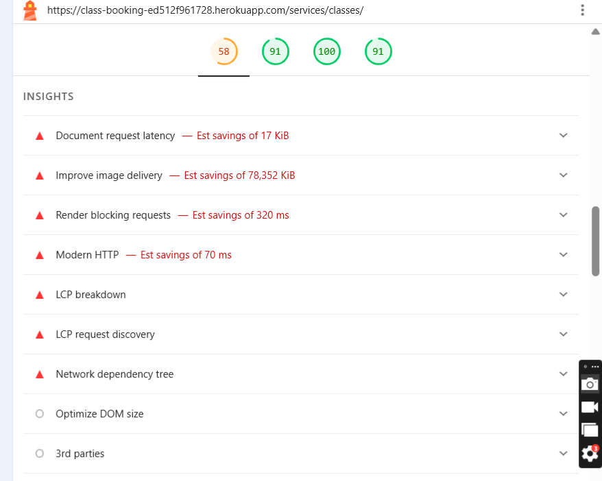

Pilates

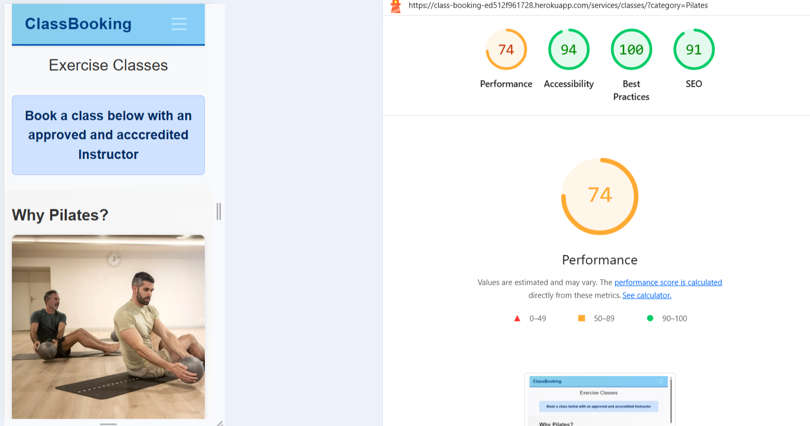

Personal Trainer

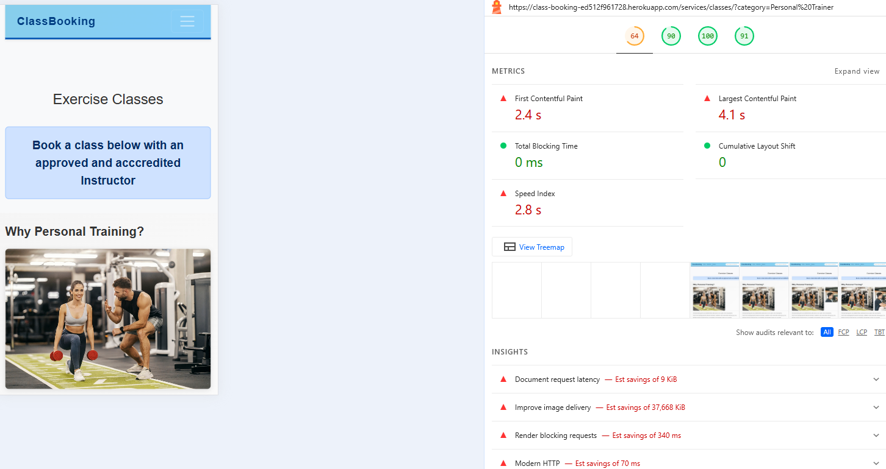

Yoga

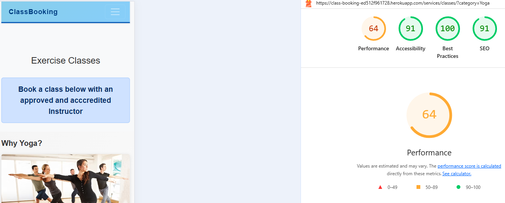

Boxercise

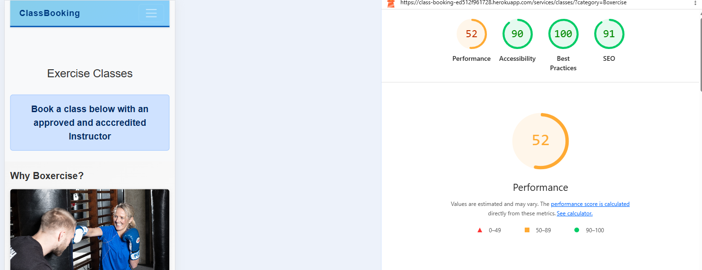

Cart

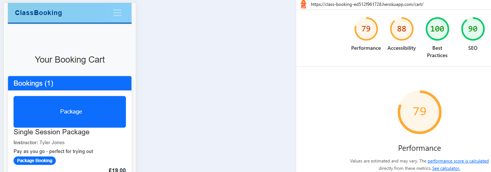

Checkout

My Bookings

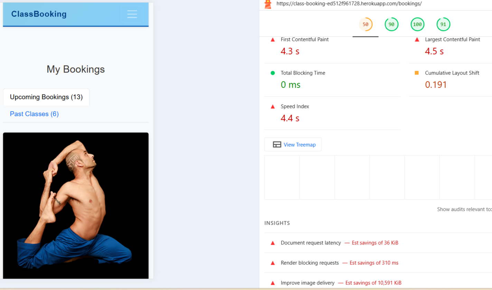

# Responsiveness
Responsive design testing has been carried out on different devices and screen sizes using [Chrome DevTools](https://developer.chrome.com/docs/devtools/)
All are now responsive across all devices. Initially, I encountered an issue where Instructors, Classes, and Search bar were not on the navigation bar for Mobile devices with smaller screens and wrapped inside the hamburger menu. Adding reusable sizing points and breakpints to css files and main-nav.html file chnaged this so links are present on the navigation bar, and even on smaller devices where devices are viewed in landscape view instead of being wrapped under the hamburger menu.

Mobile/ Tablet Devices physically tested:

* Iphone X
* Iphone X Max
* Ipad Pro 3rd Generation
* Ipad Pro 5th Generation

Results below

| Device Model            | Screen size resolution (px) | Registration | Login | Forgotten Password | Instructors | Classes | PT/Yoga/Pilates/Boxercise pages | Cart | Checkout | Adjust Cart | My Bookings | Contact Us | Social Media Links | Image Visibility |
| ----------------------- | --------------------------- | ------------ | ----- | ------------------ | ----------- | ------- | ------------------------------- | ---- | -------- | ----------- | ----------- | ---------- | ------------------ | ---------------- |
| Iphone X                | 1125 x 2436px               | Pass         | Pass  | Pass               | Pass        | Pass    | Pass                            | Pass | Pass     | Pass        | Pass        | Pass       | Pass               | Pass             |
| Iphone X max            | 2688 x 1242px               | Pass         | Pass  | Pass               | Pass        | Pass    | Pass                            | Pass | Pass     | Pass        | Pass        | Pass       | Pass               | Pass             |
| Ipad Pro 3rd Generation | 2388 by 1668 px             | Pass         | Pass  | Pass               | Pass        | Pass    | Pass                            | Pass | Pass     | Pass        | Pass        | Pass       | Pass               | Pass             |
| Ipad Pro 5th Generation | 2732 by 2048 px             | Pass         | Pass  | Pass               | Pass        | Pass    | Pass                            | Pass | Pass     | Pass        | Pass        | Pass       | Pass               | Pass             |

I physically tested the site across three different web browsers. Chrome being default, Microsoft Edge and Apple Safari. I found that some images on my home page were not presented well on Chrome as they were on Apple Safari web browser.This was vice versa, where some images were presenting better on Safari instead of Chrome and Microsoft Edge. I checked my css styling properties and my current setup includes object-fit: cover, width: 100%, and responsive container which is already compatible with Safari and Edge.I attempted to use Adobe Express to crop the images, save in jpg and png but did not make a difference. I finally resolved this by applying media thumb-165 with height-auto and max-height:150px to fix mobile cropping on home page and better visibility. Devices need their browsing data and cache deleted for changes to be synchronized.

-   ### Testing site functionality

Manual testing was performed on the site with multiple different testing scenarios. Please see below

| Site Page                                     | Testing Performed                                                                                                                                                                                                                                 | Expected Outcome                                                                                                                                                                                                                                                                                                                 | Result |
| --------------------------------------------- | ------------------------------------------------------------------------------------------------------------------------------------------------------------------------------------------------------------------------------------------------- | -------------------------------------------------------------------------------------------------------------------------------------------------------------------------------------------------------------------------------------------------------------------------------------------------------------------------------- | ------ |
| Registration  Page on Navbar                  | Clicking on Register link on Navigation bar. Opens up a new registration window enabling users to create a new account by entering and re-entering their email address, desired username and password to meet a criteria and clicking a 'Sign Up' | Right hand corner displays a popup as "Successfully signin as entered username. On top right hand corner of nav bar shows the login name                                                                                                                                                                                         | Pass   |
| Signout on Navigation Bar                     | Clicked sign out on navigation bar on top right hand corner. A pop up window is presented , requesting confimation prompt to sign out.Confirmed Sign out                                                                                          | When confirmed sign out, receiving a pop up window on top right hand corner below nav bar confirming "You have signed-out. Username previously displayed disappeared and replaced with 'Login'                                                                                                                                   | Pass   |
| Login on Nav Bar                              | Clicked login from top right hand corner on Nav bar. Presented with login window 'Login to Your Account' Entered Login and Password                                                                                                               | Right hand corner displays a popup as "Successfully signin as entered username. On top right hand corner of nav bar shows username                                                                                                                                                                                               | Pass   |
| Forgotten Password from Login page on Nav Bar | Click Login, select 'forgotten password ?''. Presented with an option to enter email address and click Reset Password                                                                                                                             | Received email from Service Booking Platform with  a link to reset password  and enter new password twice that meets password criteria. Password changed successfully.                                                                                                                                                           | Pass   |
| Search function on Navigation bar             | Entered first or surname of any instructor Example John or Anderson. Entered  a class type Example Yoga or Pilates                                                                                                                                | First or surname of instructor brings up a new page with heading Instructors with their name and profile photos . Entering a class type, displays a list of Instructors and profile photos teaching for that class type. All Instructors displayed are enabled with a clickable function directed to their personal profile page | Pass   |
| Instructors from Navigation bar               | Click Instructors link from Navigation Bar                                                                                                                                                                                                        | Presents me with a list of Instructors from the site, with image and profile descriptions and a button to view their profiles.                                                                                                                                                                                                   | Pass   |
| Classes from Navigation bar                   | Clicked classes, then all classes from Nav Bar                                                                                                                                                                                                    | The page displays all Instructors with images and descriptions by class types, totalling 10 instructors. 3  who are personal trainers, 3 who are yoga instructors, 2 instructors who are  Pilates Instructors and 2 who are Boxercise Instructors. Each Instructor has a clickable View Profile and Book Class                   | Pass   |
| Yoga Class                                    | Click Yoga from Classes                                                                                                                                                                                                                           | Presents me with a list of Yoga Instructors from the site, with image and profile descriptions . A button to view their profiles in detail and book a class                                                                                                                                                                      | Pass   |
| Personal Trainer                              | Click Personal Trainer from Classes                                                                                                                                                                                                               | Presents me with a list of Personal Training Instructors from the site, with image and profile descriptions . A button to view their profiles in detail and book a class                                                                                                                                                         | Pass   |
| Pilates                                       | Click Pilates from classes                                                                                                                                                                                                                        | Presents me with a list of Pilates Instructors from the site, with image and profile descriptions . A button to view their profiles in detail and book a class                                                                                                                                                                   | Pass   |
| Boxercise                                     | Click boxercise from Classes                                                                                                                                                                                                                      | Presents me with a list of Boxercise Instructors from the site, with image and profile descriptions . A button to view their profiles in detail and book a class.                                                                                                                                                                | Pass   |
| Personal Trainer                              | Select a Personal Trainer to View Profile and Book Class                                                                                                                                                                                          | Brings you to a page with Instructors detailed profile, details about the class, the rates and package options to book a class                                                                                                                                                                                                   | Pass   |
| Pilates Instructor                            | Select a Pilates Instructor to View Profile and Book Class                                                                                                                                                                                        | Brings you to a page with the selected Pilates Instructors detailed profile, details about the class and, the rates and package options to book a class                                                                                                                                                                          | Pass   |
| Cart Page for Personal Trainer                | Within a specific personal training instructors page, under rates and packages , select the single sessions line.  Once its highlighted , then select add to cart.                                                                                | Presented with a booking cart page, displaying the SubTotal amount and the option to click proceeed checkout.                                                                                                                                                                                                                    | Pass   |
| Booking Cart                                  | Once a class has been selected and added to cart, In the booking cart  displaying booking and subtotal, select the remove button in red. This is usually done if a class has been selected and added to the cart in error                         | Presented with a pop up prompt to confirm removal of class. Once Confirmed, receiving a message on broswer window that your cart is empty.                                                                                                                                                                                       | Pass   |
| Checkout for Personal Trainer                 | Once Proceed Checkout is selected, the checkout page opens with the option to enter card payment details in test mode  and click complete order.                                                                                                  | Presented with a booking confirmed page with booking items details and payment summary and details where confirmation email has been sent to.                                                                                                                                                                                    | Pass   |
| Cart Page for Pilates                         | View Details of Pilates Instructor, under rates and packages , select the 10 session package.  Once its highlighted , then select add to cart.                                                                                                    | Presented with a booking cart page, displaying the SubTotal amount and the option to click proceeed checkout.                                                                                                                                                                                                                    | Pass   |
| Checkout for Pilates                          | Once Proceed Checkout is selected, the checkout page opens with the option to enter card payment details in test mode  and click complete order.                                                                                                  | Presented with a booking confirmed page with booking items details and payment summary and details where confirmation email has been sent to.                                                                                                                                                                                    | Pass   |
| Select a scheduled Boxercise class            | Select Classes, Boxercise and view details of a listed boxercise Instructor. Scroll down to find details of upcoming scheduled boxercise class and view details                                                                                   | Presented with class information, price, date, time and location class  and option to add to cart                                                                                                                                                                                                                                | Pass   |
| Checkout scheduled boxercise class from class | Once in the booking cart page for the selected scheduled class, select proceed checkout and enter card payment details and complete order                                                                                                         | Presented with a booking confirmed page with booking items details and payment summary and details where confirmation email has been sent to.                                                                                                                                                                                    | Pass   |
| Booking Cart                                  | Once a class has been selected and added to cart, In the booking cart  displaying booking and subtotal, select the remove button in red. This is usually done if a class has been selected and added to the cart in error                         | Presented with a pop up prompt to confirm removal of class. Once Confirmed, receiving a message on broswer window that your cart is empty.                                                                                                                                                                                       | Pass   |
| Booking Cart                                  | From checkout page, also have the option of adjusting cart. Click 'Adjust Cart'                                                                                                                                                                   | Presented with booking cart page, displaying booking with the red button to remove. Once clicked, class can be removed                                                                                                                                                                                                           | Pass   |
| Select a scheduled Yoga class                 | Select Classes, Yoga and view details of a listed Yoga Instructors. Scroll down to find details of upcoming scheduled yoga class and view details                                                                                                 | Presented with class information, price, date, time and location class  and option to add to cart                                                                                                                                                                                                                                | Pass   |
| Checkout scheduled Yoga class from class      | Once in the booking cart page for the selected scheduled class, select proceed checkout and enter card payment details and complete order                                                                                                         | Presented with a booking confirmed page with booking items details and payment summary and details where confirmation email has been sent to.                                                                                                                                                                                    | Pass   |
| Bookings                                      | Once booking has been confirmed, select My Bookings from profile                                                                                                                                                                                  | All confirmed bookings are visible                                                                                                                                                                                                                                                                                               | Pass   |
| Email confirmation                            | Checked email to confirm booking confirmation received                                                                                                                                                                                            | Email with all required details received                                                                                                                                                                                                                                                                                         | Pass   |
| Stripe                                        | After booking confirmation, Open Stripe dashoboard, select workbench in test mode,  check webhooks and Events                                                                                                                                     | Shows deliveries to webhook points succeeded, events show all successful transaction records                                                                                                                                                                                                                                     | Pass   |
| Contact Form                                  | Open Contact Us form from Footer under Quick Links, complete required fields and send message                                                                                                                                                                                | Form is sent without errors and received by recepient                                                                                                                                                                                                                                                                            | Pass   |
# Bugs, Issues and Solutions

| Problem/Error                                                                                                                                                                                                                         | Solution                                                                                                                                                                                   | Fixed |
| ------------------------------------------------------------------------------------------------------------------------------------------------------------------------------------------------------------------------------------- | ------------------------------------------------------------------------------------------------------------------------------------------------------------------------------------------ | ----- |
| Unable to complete booking for class. Atrribute error on browser and dev console                                                                                                                                                      | No object or no attribute Added Object in settings.py                                                                                                                                      | Yes   |
| Unable to checkout. Error. "Service Matching Query Does not exist at checkout"                                                                                                                                                        | Updated checkout flows on views.py, urls.py, checkout.html and checkout_success.html                                                                                                       | Yes   |
| Unable to remove a or add an additional class on bookings page. Receiving "Errror processing booking"                                                                                                                                 | Replaces item class with item exercise class in views.py. Dev tools console shows, "To fix use unique id". Models fields did not match, therefore adjusted models.py.                      | Yes   |
| Template Syntax error when selcting intructor_profile.html. Divs and div10 did not exist in Django.                                                                                                                                   | Used width ration template tag instead.                                                                                                                                                    | yes   |
| Unable to load Instructor images with profiles. Received "Improper configured error, could not load BOTOS S3 Binding"                                                                                                                 | Modified custom_storages.py to import s3 storage classes and imports s3 botobackend at top level                                                                                           | Yes   |
| Unable to add an image on Django Admin Panel Error "Invalid Access Key ID, AWS KeyId does not exist in our records"                                                                                                                   | uncommented USE_AWS in env.py Checked key exists in AWS and corresponded with AWS IAM Access Key and secret key in env.py then renabled Use_AWS                                            | Yes   |
| Error when selecting "Proceed to checkout". Error Message "payment error, Invalid API Key sk_test_" No errors in Dev Tools Console                                                                                                    | Stripe key is being set a module import time in checkout/views.py. Adjusted stripe settings in checkout/views.py                                                                           | Yes   |
| End User not receiving email confirmation after successfully booking a class with onscreen confirmation                                                                                                                               | Application Configured to 'Print' emails to terminal not 'Send'.Email delivery config to print to log instead of send. Adjusted settings.py by applying SMTP, using an IF Debug statement. | Yes   |
| After Bookings is complete, clicking view booking sessions diverts to incorrect page with personal training instructors. Problem is home card links on index.html dont pass any categories.                                           | Updated Home Card links on index.html. Applied category filtering and removed cross category fallback in views.py                                                                          | Yes   |
| Unable to open site on heroku after successful build and deployment. Error 400 , Bad Request" Django rejects requests from hosts not listed in "Allowed Hosts"                                                                        | Added Heroku hostname to Allowed hosts in settings.py                                                                                                                                      | Yes   |
| Unable to display images on heroku. dev tools console shows images failed to load "collect static images not uploaded to AWS Bucket and incorrect variables declared in heroku and possible inccorect region set in AWS Bucket region | Added images to static/media folder in AWS S3 bucket and edited heroku config variables                                                                                                    | Yes   |
| Error on page after unified search function was implemented on site. Dev tools console showed error 500                                                                                                                               | Fixed nav bar search input on main-nav.html to avoid 'Query Dict' Error                                                                                                                    | Yes   |
| Unable to login to site, error 500 Console dev tools error "failed to load resource". Caused because Django AllAuth package updated and  column new 'Provider_id' was added  to table, withouot running Heroku migrations             | Ran 'heroku  run python manage.py migrate -a class-booking' in terminal                                                                                                                    | Yes   |
| incorrect email sender name displayed from confirmation mail. Caused by mismatch in default_from_Email                                                                                                                                | Adjusted models.py, settings.py and views.py . Adjusted checkout/views.py to use correct email sent                                                                                        | Yes   |
| Stripe Portal: Internal payment error, failed delivery to webhook endpoint'. Cause Stripe wh_sec key value empty in Heroku config vars and env.py"                                                                                    | Added stripe wh_secret key values to env.py and heroku variables                                                                                                                           | Yes   |
