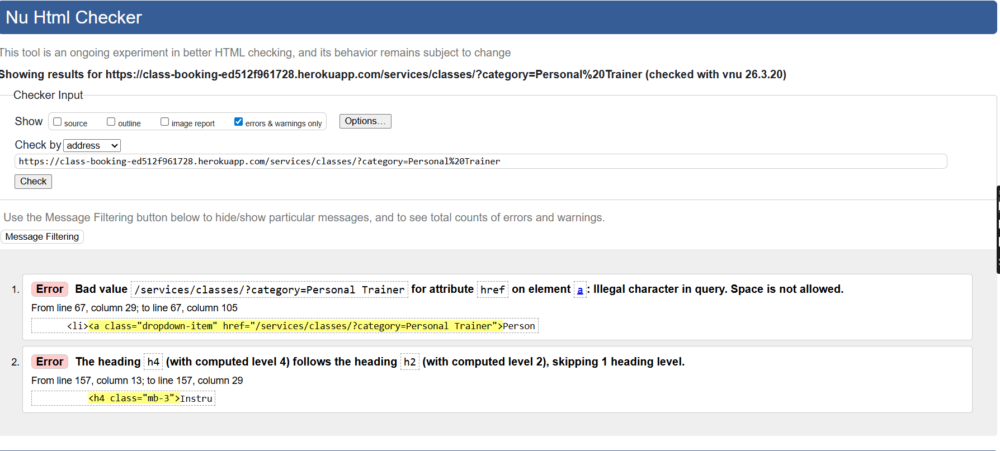

# Class-Booking - Testing

# Table of content

* [Validation](#validation)
    * [HTML Validation](#html-validation)
    * [CSS Validation](#css-validation)
    * [JavaScript Linting](#javascript-linting)
    * [Python Linting](#python-linting)
    * [Lighthouse Testing](#lighthouse-testing)
    * [Wave Testing](#wave-testing)
* [Responsiveness](#responsiveness)
* [Manual Testing](#manual-testing)
* [User Stories Testing](#user-stories-testing)
* [Bugs, Issues and Solutions](#bugs-issues-and-solutions)

# Validation 
## HTML Validation
The initial test of the page validated by URL using [W3C HTML Validator](https://validator.w3.org/#validate_by_uri) showed couple of errors but were fixed:

 | Page on site              | Error                                                                                                                                                                                              | Fixed |
| ------------------------- | -------------------------------------------------------------------------------------------------------------------------------------------------------------------------------------------------- | ----- |
| Classes/ Personal Trainer | Bad Value for attribute href on element Illegal character in query. Space is not allowed                                                                                                           | Yes   |
| Classes/ Personal Trainer | The heading h4 follows the heading h2 (with computed level 2) skipping 1 heading level                                                                                                             | Yes   |
| Classes/Pilates           | The heading h4 follows the heading h2 (with computed level 2) skipping 1 heading level                                                                                                             | Yes   |
| Accounts/Login            | The heading h4 follows the heading h2 (with computed level 2) skipping 1 heading level                                                                                                             | Yes   |
| Accounts/Password/Reset   | Consider adding a lang attribute to the html start tag to declare the language of this document. Trailing slash on void elements has no effect and interacts badly with unquoted attribute values. | Yes   |
| Accounts/Password/Reset   | Consider adding a lang attribute to the html start tag to declare the language of this document.                                                                                                   | Yes   |

I have attached screenshots of the test results

Final result

Final result

Final result

### Testing User Stories

  #### Viewing and Navigation

        1. As a site user, i want to be able to view the website on a range of device sizes and it needs to be aesthetic and functional
        - Site is responsive on devices from 280px
        - Navbar available on each page for ease of navigation
        2. As a parent/guardian, i want to easily understand the purpose of the website
        - The navbar and hero image on the index page instantly informs the user of the site name in the logo and what the business does in the text on the hero image.
        - The colourful design and choice of images supports the message of what the business does.

        - The navbar has a dropdown menu names 'Instructors' , Classeseasily visible on each page.
        - Clicking the courses dropdown shows the user lots of options for information on our different courses and also able to view all courses available
        - There are pages specific to each of the four age categories which gives more in depth information to the user alongside the age-specific course availability so that users can add the course straight to their bag.

        4. As a parent/guardian, i want to be able to see the available courses, the course dates and times so that i can decide if it is suitable to book.
        - Each age-specific group has its own webpage with specific information related to the course, this includes all course-specific availability so the user can easily book once they have found which course is best for their child.
        - From the all courses page the user is able to see all courses, dates and times available and can click on any date which will take them to the course details page for more information and booking options.

        5. As a registered site user, i want to view the contents of my booking cart and be able to add, edit or delete classes
        - The shopping bag is shown as a Bag icon and price located in the top left corner of each webpage. It is in the same location regardless of where the user is within the site or what device they are viewing the site on. 
        - The price is displayed below the Bag icon and is updated with any changes to the shopping bag contents so the user can quickly and easily see their bag total.
        - Clicking on the shopping bag  takes the user to the Shopping Bag page where they are shown the contents of their bag with the relevant course details so they can clearly see what they are wanting to order.
        - The bag contents can easily be updated or removed using the +/- and update/remove buttons on each order item.
        - If the shopping bag is empty, the user is shown a message to inform them of this and directed to the course details buttons for each age group.

        6. As a registered site user, i want to have a personlalised profile where i am able to view my order history and update my profile details
        - Each registered user has a profile which can be found in the Accounts dropdown in the top left corner of the webpage
        - On clicking 'My Profile' within the Account dropdown, the user is taken to their profile page. 
        - The profile page is split into two areas. The first area shown the user their saved Billing Info(if they have chosen to save it at a previous checkout) and they can update their information directly from this page. The next section is an order summary, showing a list of all previous orders.

        7. As a parent/guardian, i want to be abe to meet the team who run the courses and understand more about them and their qualifications so that i know the sessions are being run by competent practitioners
        - Within the navbar 'About' dropdown, a 'Meet the team' link takes the user to the associated are on the home page. Here, the user can find some information about the team with links to view more details about each team member. 
        - On clicking the links, the user is taken to the Meet The Team page. An image of each team member is displayed and hen the user hovers over the picture, the team members name and course speciality is shown alongside a button linking to their own page.
        - If the user then clicks the button on the instructor image, they are taken to that instructors' details page which shows some information named 'a bit about me'. This gives the user a friendly summary of the instructors' relevant qualifications and past work history.

        8. As a parent/guardian, i want to be able to see where the courses are being held so that i know where i am going to be traveling to and can plan my journey

        9. As a site user, i want to be able to contact the site owners if i have any queries and receive email confirmation that my message has been successfully sent
        - From the navbar the user can view the 'Contact' link. When clicked, this takes the user to the Booking Enquiry page where they can fill in a short form and submit. 
        - They will get an email to say that Little Pont have received their enquiry and will get back to them shortly.

        10. As a parent/guardian, i want to be able to make a party booking enquiry
        - From the navbar the user can view the 'Contact' link. When clicked, this takes the user to the Booking Enquiry page where they can fill in a short form and submit. 
        - They will get an email to say that Little Pont have received their enquiry and will get back to them shortly.
        
    
    -   #### Registration and User Account

        1. As site user, i want to be able to easily register as a student.
        2. As a registered user, i want to easily be able to login and logout of my account
        3. As a registered user, i want to be able to reset my password if i have forgotten it
        5. As registered user, i want to ensure all form fields are completed correctly
        
    

    -   #### Purchasing and Checkout
        1. As a logged in user i want to select and book  a class for myself
        2. As a site user, i want an easy and streamlined payment process
        3. As a site administrator, i want to be able to track all details of my class booking, ensuring that I have received a booking confirmation mail with relevant information and  of details my booking are visible on my booking profile

    -   #### Site Administrator
    
        1. As a site admin, i want to easily be able to add, edit or delete classes, Instructors, Instructor profile, registered users profiles a users order in case they have made a booking error and it needs to be amended, in order to provide a good user experience for them.
        2. As a site admin I want to be able to create classes according to the Instructors schedule and availability
        

-   ### Testing site functionality

| Site Page                                                        | Testing Performed                                                                                                                                                                                                                                 | Expected Outcome                                                                                                                                                                                                                                                                                                    | Result |
| ---------------------------------------------------------------- | ------------------------------------------------------------------------------------------------------------------------------------------------------------------------------------------------------------------------------------------------- | ------------------------------------------------------------------------------------------------------------------------------------------------------------------------------------------------------------------------------------------------------------------------------------------------------------------- | ------ |
| Registration  Page on Navbar                                     | Clicking on Register link on Navigation bar. Opens up a new registration window enabling users to create a new account by entering and re-entering their email address, desired username and password to meet a criteria and clicking a 'Sign Up' | Right hand corner displays a popup as "Successfully signin as entered username. On top right hand corner of nav bar shows username                                                                                                                                                                                  | Pass   |
| Signout on Navigation Bar                                        | Clicked sign out on navigation bar on top right hand corner. A pop up window is presented , requesting confimation prompt to sign out.Confirmed Sign out                                                                                          | When confirmed sign out, receiving a pop up window on top right hand corner below nav bar confirming "You have signed-out. Username previously displayed disappeared and replaced with 'Login'                                                                                                                      | Pass   |
|                                                                  |                                                                                                                                                                                                                                                   |                                                                                                                                                                                                                                                                                                                     |        |
| Login on Nav Bar                                                 | Clicked login from top right hand corner on Nav bar. Presented with login window 'Login to Your Account' Entered Login and Password                                                                                                               | Right hand corner displays a popup as "Successfully signin as entered username. On top right hand corner of nav bar shows username                                                                                                                                                                                  | Pass   |
| Forgotten Password from Login page on Nav Bar                    | Click Login, select 'forgotten password ?''. Presented with an option to enter email address and click Reset Password                                                                                                                             | Received email from Service Booking Platform with  a link to reset password  and enter new password twice that meets password criteria                                                                                                                                                                              | Pass   |
| Search function on Navigation bar                                | Entered first or surname of any instructor Example John or Anderson. Entered  a class type Example Yoga or Pilates                                                                                                                                | First or surname of instructor brings up a new page with heading Instructors with their name and profile photos . Entering a class type, displays a list of Instructors and profile photos teaching for that class type. All Instructors displayed are a clickable function directed to their personal profile page | Pass   |
| Instructors from Navigation bar                                  | Click Instructors link from Navigation Bar                                                                                                                                                                                                        | Presents me with a list of Instructors from the site, with image and profile descriptions and a button to view their profiles.                                                                                                                                                                                      | Pass   |
| Classes from Navigation bar                                      | Clicked classes, then all classes from Nav Bar                                                                                                                                                                                                    | The page displays all Instructors with images and descriptions by class types, totalling 10 instructors. 3  who are personal trainers, 3 who are yoga instructors, 2 instructors who are  Pilates Instructors and 2 who are Boxercise Instructors. Each Instructor has a clickable View Profile and Book Class      | Pass   |
| Select Yoga Class                                                | Click Yoga from Classes                                                                                                                                                                                                                           | Presents me with a list of Yoga Instructors from the site, with image and profile descriptions . A button to view their profiles in detail and book a class                                                                                                                                                         | Pass   |
| Select Personal Trainer                                          | Click Personal Trainer from Classes                                                                                                                                                                                                               | Presents me with a list of Personal Training Instructors from the site, with image and profile descriptions . A button to view their profiles in detail and book a class                                                                                                                                            | Pass   |
| Select Pilates                                                   | Click Pilates from classes                                                                                                                                                                                                                        | Presents me with a list of Pilates Instructors from the site, with image and profile descriptions . A button to view their profiles in detail and book a class                                                                                                                                                      | Pass   |
| Select Boxercise                                                 | Click boxercise from Classes                                                                                                                                                                                                                      | Presents me with a list of Boxercise Instructors from the site, with image and profile descriptions . A button to view their profiles in detail and book a class.                                                                                                                                                   | Pass   |
| Select a Personal Trainer                                        | Select a Personal Trainer to View Profile and Book Class                                                                                                                                                                                          | Brings you to a page with Instructors detailed profile, details about the class, the rates and package options to book a class                                                                                                                                                                                      | Pass   |
| Select a Pilates Instructor                                      | Select a Pilates Instructor to View Profile and Book Class                                                                                                                                                                                        | Brings you to a page with the selected Pilates Instructors detailed profile, details about the class and, the rates and package options to book a class                                                                                                                                                             | Pass   |
| Book a single session Personal Training class from the cart      | Within a specific personal training instructors page, under rates and packages , select the single sessions line.  Once its highlighted , then select add to cart.                                                                                | Presented with a booking cart page, displaying the SubTotal amount and the option to click proceeed checkout.                                                                                                                                                                                                       | Pass   |
| Checkout the single session for booking Personal Trainer session | Once Proceed Checkout is selected, the checkout page opens with the option to enter card payment details in test mode  and click complete order.                                                                                                  | Presented with a booking confirmed page with booking items details and payment summary and details where confirmation email has been sent to.                                                                                                                                                                       | Pass   |
| Checkout a 10 sessions package class for booking a Pilates s     | View Details of Pilates Instructor, under rates and packages , select the 10 session package.  Once its highlighted , then select add to cart.                                                                                                    | Presented with a booking cart page, displaying the SubTotal amount and the option to click proceeed checkout.                                                                                                                                                                                                       | Pass   |
| Checkout the 10 session package for booking Pilates session      | Once Proceed Checkout is selected, the checkout page opens with the option to enter card payment details in test mode  and click complete order.                                                                                                  | Presented with a booking confirmed page with booking items details and payment summary and details where confirmation email has been sent to.                                                                                                                                                                       | Pass   |
| Select a scheduled Boxercise class                               | Select Classes, Boxercise and view details of a listed boxercise Instructor. Scroll down to find details of upcoming scheduled boxercise class and view details                                                                                   | Presented with class information, price, date, time and location class  and option to add to cart                                                                                                                                                                                                                   | Pass   |
| Checkout scheduled boxercise class from class                    | Once in the booking cart page for the selected scheduled class, select proceed checkout and enter card payment details and complete order                                                                                                         | Presented with a booking confirmed page with booking items details and payment summary and details where confirmation email has been sent to.                                                                                                                                                                       | Pass   |
| Remove a class from Booking Cart                                 | Once a class has been selected and added to cart, In the booking cart  displaying booking and subtotal, select the remove button in red. This is usually done if a class has been selected and added to the cart in error                         | Presented with a pop up prompt to confirm removal of class. Once Confirmed, receiving a message on broswer window that your cart is empty.                                                                                                                                                                          | Pass   |

